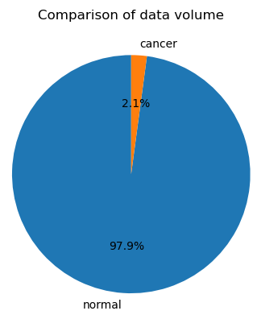
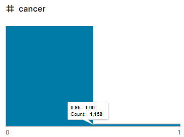

## 简介

乳腺疾病检测一直是一个很有研究意义的课题，[RSNA 2023乳腺疾病分类竞赛](https://www.kaggle.com/competitions/rsna-breast-cancer-detection) 为我们提供了丰富的乳腺图像和EHR数据信息，然而这些图像是需要进行处理的，本repo旨在构建分类、检测、分割全方位的RSNA数据使用格式。

## 步骤

1. 使用[dicom-resized-png-jpg](https://www.kaggle.com/code/theoviel/dicom-resized-png-jpg) （[备用](https://github.com/mpu-tt/rsna-breast-dataset/blob/main/code/1-dicom-resized-png-jpg.ipynb) ）对原始`Dicom`图转为`png/jpg`图，转为的图像大小支持[256-1GB](https://www.kaggle.com/datasets/theoviel/rsna-breast-cancer-256-pngs) 、[512-4GB](https://www.kaggle.com/datasets/theoviel/rsna-breast-cancer-512-pngs) 、[768-8GB](https://www.kaggle.com/datasets/theoviel/rsna-breast-cancer-768-pngs) 、[1024-14GB](https://www.kaggle.com/datasets/theoviel/rsna-breast-cancer-1024-pngs) 。
2. 使用[breast-detection](https://github.com/mpu-tt/breast-detection) 可以对`png/jpg`格式数据进行**粗裁剪**或者**粗标注**。（**粗**意味着可能丢失部分乳腺图像的部位信息，如[裁剪掉胸肌信息](https://github.com/mpu-tt/breast-detection/raw/main/images/train_epoch_vis.jpg) ）
3. 使用[rsna-cut-off-empty-space-from-images](https://www.kaggle.com/code/vslaykovsky/rsna-cut-off-empty-space-from-images) （[备用](https://github.com/mpu-tt/rsna-breast-dataset/blob/main/code/2-rsna-cut-off-empty-space-from-images.ipynb) ）可以对`png/jpg`格式数据进行**细裁剪**。（如[保留额外胸肌信息](./images/cut_of_empty.png)）
4. 使用[classification](https://github.com/mpu-tt/rsna-breast-dataset/blob/main/code/3-classification.ipynb) 构建二分类乳腺数据集（可以基于步骤2和3基础上进行）；

|分类统计|分类统计|
|:-:|:-:|
|||

## 资源

1. [RSNA2023乳腺疾病原始数据-200+GB](https://www.kaggle.com/competitions/rsna-breast-cancer-detection/data) ，包含病人元信息和Dicom乳腺信息
2. [RSNA2023乳腺疾病PNG图256尺寸数据](https://www.kaggle.com/datasets/theoviel/rsna-breast-cancer-256-pngs) 
3. [RSNA2023乳腺疾病PNG图512尺寸数据](https://www.kaggle.com/datasets/theoviel/rsna-breast-cancer-512-pngs) 
4. [RSNA2023乳腺疾病PNG图768尺寸数据](https://www.kaggle.com/datasets/theoviel/rsna-breast-cancer-768-pngs) 
5. [RSNA2023乳腺疾病PNG图1024尺寸数据](https://www.kaggle.com/datasets/theoviel/rsna-breast-cancer-1024-pngs)
